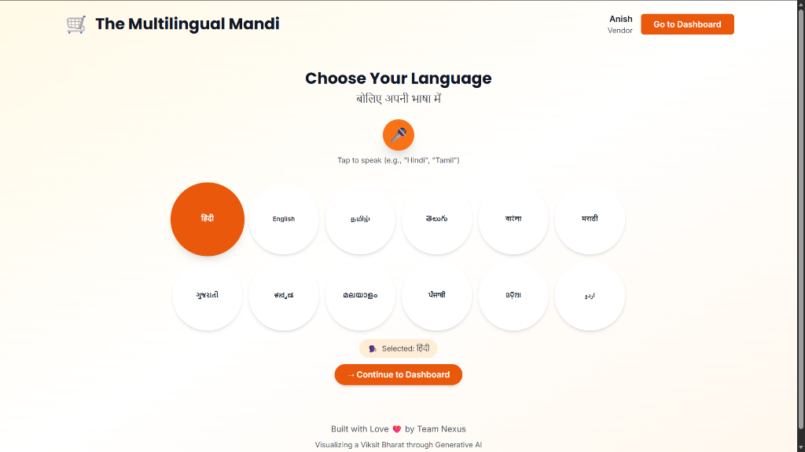
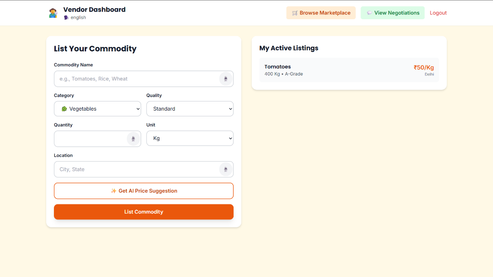
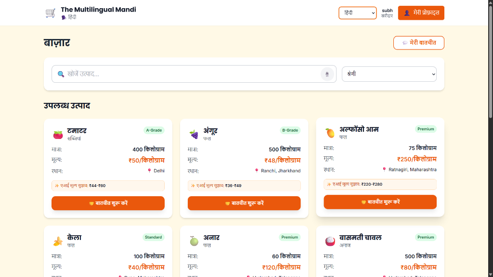
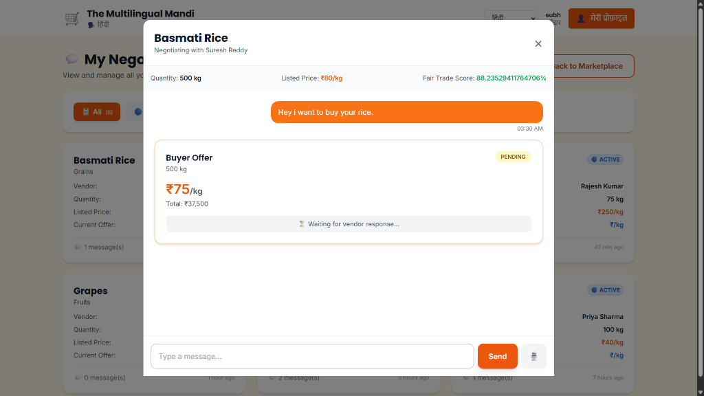
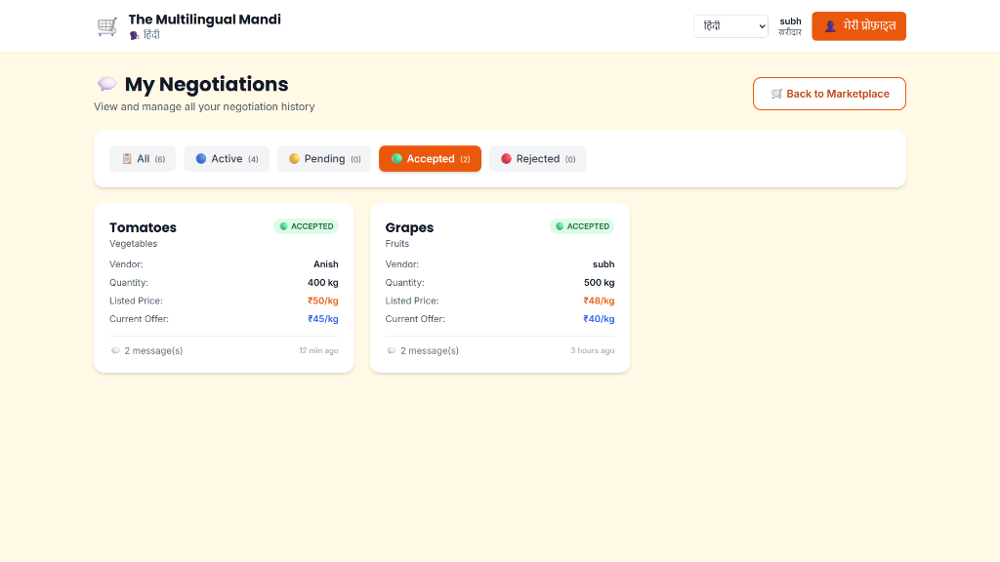

# M-Mandi (The Multilingual Mandi) 🌾🚜

**M-Mandi** is a next-generation, AI-powered digital marketplace connecting farmers (vendors) and buyers across India. It breaks down language barriers and empowers users with real-time price discovery, voice-enabled interactions, and transparent negotiations.



## 🌟 Key Features

### 🗣️ Multilingual & Voice-First
*   **12+ Indian Languages**: Full support for Hindi, Tamil, Telugu, Bengali, Marathi, and more.
*   **Voice Search & Forms**: Vendors can list products and buyers can search just by speaking.
*   **Voice Negotiation**: Negotiate prices using voice commands in your native language.

### 🤖 AI-Powered Price Discovery
*   **Smart Pricing**: AI analyzes market trends to suggest fair prices for commodities.
*   **Transparency**: Breakdown of pricing factors (market demand, seasonality, location).

### 💬 Real-Time Negotiations
*   **Interactive Chat**: dedicated negotiation rooms for buyers and sellers.
*   **Offer Management**: Make, accept, reject, and counter-offer in real-time.
*   **History**: Complete history of all past and active negotiations.

## 📸 Screenshots

### Vendor Dashboard
*AI-powered listing creation with voice support.*


### Marketplace & Search
*Voice-enabled search filters for instant results.*


### Negotiation Room
*Real-time chat with offer management and voice input.*


### Negotiation History
*Track all your active and completed deals.*



## Scope & Clarifications

• This project demonstrates core UI/UX flows including language selection, vendor dashboard, marketplace browsing, and negotiation UI.

• Real-time price suggestions are simulated for demo purposes; generative AI integration is conceptual at this stage.

• Role-based flows (Vendor vs Buyer) are shown, with Vendor listing enabled accordingly.

• Language preference is applied at key interaction points; future versions will extend full localization.

• Authentication and production-grade backend logic are outside scope for this challenge demo.


## 🛠️ Tech Stack

*   **Frontend**: React.js, Tailwind CSS, Vite
*   **Backend**: Node.js, Express.js
*   **Database**: MongoDB
*   **AI/ML**: Generative AI for translations and price analysis
*   **Real-time**: Socket.io for negotiations

## 🚀 Getting Started

1.  **Clone the repository**
    ```bash
    git clone https://github.com/Subhampas1/m-mandi.git
    cd m-mandi
    ```

2.  **Install dependencies**
    ```bash
    # Backend
    cd backend
    npm install

    # Frontend
    cd ../frontend
    npm install
    ```

3.  **Run the application**
    ```bash
    # Terminal 1 (Backend)
    cd backend
    npm run dev

    # Terminal 2 (Frontend)
    cd frontend
    npm run dev
    ```

---
*Built with ❤️ for Indian Farmers*
